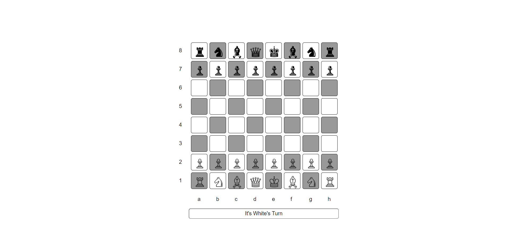

  

<h1 align="center">
  Chess Board 
</h1>

<h3 align="center">
  Game Development
</h3>

  

The "Chessboard Game" repository contains the code for a web-based chess game that allows players to compete against each other in real-time. The game is built using HTML, CSS, and JavaScript, and uses a range of front-end tools and libraries to provide a responsive and intuitive user interface.
Overall, the "Chessboard Game" repository offers a valuable resource for developers and designers who want to build their own web-based chess games, and provides a range of features and tools to support gameplay, customization, and analysis.

  
<!-- ................................................................................................................................. -->

### Features
 
Following are some of the new features and learning encountered while creating this amazing project:

- <b>Real-time gameplay:</b>  Players can compete against each other in real-time, with moves and actions being reflected instantly on the game board.
- <b>Customizable game settings:</b>  Users can customize the game settings, including the starting position, time controls, and piece styles, to suit their preferences.
- <b>Interactive game board:</b>  The game board is interactive, allowing players to click and drag pieces to make moves, and highlighting legal moves and potential threats.
- <b>User-friendly interface:</b>  The interface is designed to be intuitive and user-friendly, with clear labeling and easy-to-use controls.
- <b>Game analysis and history:</b>  The game includes features for analyzing and reviewing previous moves and games, allowing players to learn from their mistakes and improve their gameplay.
- <b>Sound and visual effects:</b>  The game includes sound and visual effects for moves, captures, and other actions, adding to the overall experience of playing.
- <b>Multiplayer support:</b>  The game supports multiplayer gameplay, allowing players to compete against each other from anywhere in the world.
- <b>Error checking and validation:</b>  The game checks for legal moves and alerts players to any errors or mistakes in their gameplay. 
- <b>Responsive design:</b>  The game is designed to be responsive and mobile-friendly, allowing players to enjoy the game on a range of devices.
- <b>Integration with external libraries and APIs:</b>  The game can be integrated with external libraries and APIs to provide additional functionality and features.

  
<!-- ................................................................................................................................. -->

### Resources
 
Follwing resources have been used in maintaining this project:

- [Vecteezy](https://www.vecteezy.com/vector-art/8215476-chess-queen-line-pop-art-potrait-logo-colorful-design-with-dark-background-abstract-vector-illustration-isolated-black-background-for-t-shirt-poster-clothing-merch-apparel-badge-design) for logo of this game.

  
<!-- ................................................................................................................................. -->

### Demo

  The Demo of this working project can be found on  
  <a href="https://rebrand.ly/ChessboardGame_MABCORP">rebrand.ly/ChessboardGame_MABCORP</a>

  
<!-- ................................................................................................................................. -->

### Video

You can exclusively watch the video on this project from the making to deploying on my     channel with the link given below 

  [Video Link](# )  

  If you like my video then do Like the Video and share it with others.

  
<!-- ................................................................................................................................. -->

### Game User Interface  

  
<!-- ................................................................................................................................. -->

### Technology Stack
 
Follwing technologies have been used at the core of this application to make it stand in the market place:

- HTML
- CSS
- JavaScript

  
<!-- ................................................................................................................................. -->

### Advancement

> - Player can use their turn to move other than the specified values. This needs to be corrected.   
> - The Game is not responsive yet

  
<!-- ................................................................................................................................. -->

### Deployment Details

The website is deployed using the free hosting provided by **Vercel**

  

  
Later on the link was customized using the well-known URL shortener and customizer **Rebrandly**:  

  

  
<!-- ................................................................................................................................. -->

### Developer

Muhammad Abdullah Butt  
abdullahbutt12292210@gmail.com  
> [Instagram](https://www.instagram.com/abdullah.butt.22/) 
> [FaceBook](https://www.facebook.com/profile.php?id=100076291614529) 
> [YouTube](https://www.youtube.com/channel/UCnuOFQyMywg-KuoN-lmav1Q) 
> [Portfolio](https://rebrand.ly/MuhammadAbdullahButt_MABCORP) 
> [Project Displayer]( https://rebrand.ly/ProjectDisplayer_MABCORP)
  
<!-- ................................................................................................................................. -->

